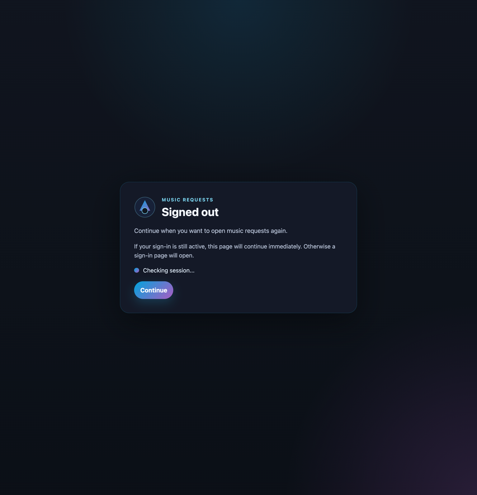
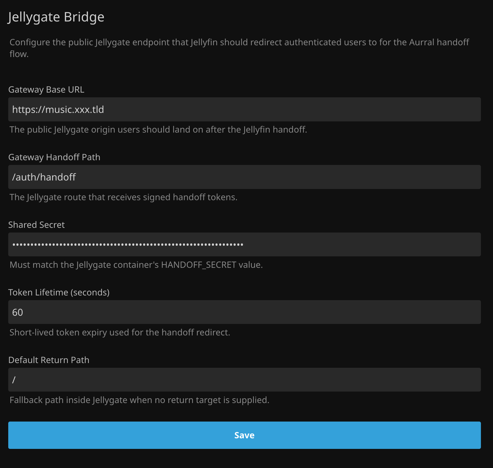
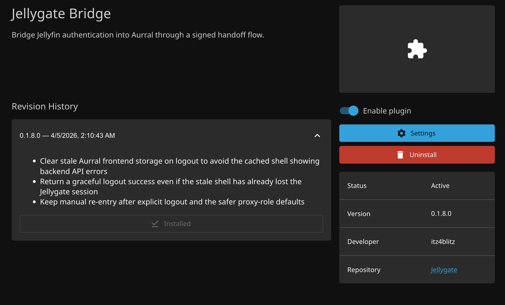

# Jellygate

`Jellygate` is the auth handoff layer between `Jellyfin` and `Aurral`.

It is built for the self-hosted music setup where:

- `Jellyfin` already owns your users and passwords
- `jfa-go` already manages invites and user lifecycle for Jellyfin
- `Aurral` handles music requests and Lidarr-driven discovery
- `Aurral` supports reverse-proxy auth, but not Jellyfin auth directly

Jellygate closes that gap with two small pieces:

- a gateway that sits in front of `Aurral`
- a Jellyfin plugin that performs a safe browser handoff from the Jellyfin origin

The goal is simple:

- users open `music.example.com`
- if they already have a Jellyfin session, they flow straight into `Aurral`
- if they do not, they sign into Jellyfin and then land in `Aurral`
- when they log out, they return to the handoff page instead of getting stuck in Aurral's own login state

## What It Does

- reuses an existing Jellyfin browser session when one is already present
- opens Jellyfin sign-in when a session is missing, then completes the handoff into Aurral
- issues its own gateway session cookie after a successful handoff
- proxies into Aurral with trusted `X-Forwarded-User` and `X-Forwarded-Role` headers
- keeps unknown proxied users non-admin by default
- returns sign-outs to the bridge flow instead of dropping users into a broken Aurral auth state
- ships as one gateway container plus one Jellyfin plugin artifact
- includes an Unraid template for install and update flow

## Screenshots

### Music Request Handoff



### Jellyfin Plugin Config



### Jellyfin Plugin Details



## Repo Layout

- `apps/gateway`: Fastify auth gateway and Aurral reverse proxy
- `apps/web`: Svelte login UI bundled into the gateway image
- `plugins/Jellygate.JellyfinBridge`: Jellyfin plugin for signed handoff redirects
- `templates/unraid/Jellygate.xml`: Unraid template for the gateway container
- `docs/`: architecture and deployment notes

## Login Flows

### Default browser flow

1. User opens the Jellygate host
2. Jellygate redirects to the Jellyfin bridge helper route
3. The helper page checks the current browser's Jellyfin session data on the Jellyfin origin
4. If a Jellyfin token is already present, the helper calls the authenticated bridge session endpoint immediately
5. If no token is present, the helper stays on the handoff page and opens Jellyfin sign-in in another tab when the user continues
6. Once sign-in completes, the original handoff page detects the new Jellyfin session and requests a short-lived signed handoff URL
7. Jellygate validates that token, creates its own session cookie, and forwards the user into Aurral
8. On logout, the user returns to the bridge page in manual mode instead of falling through to Aurral's own login UI

### Optional direct credential flow

1. User opens the Jellygate host
2. Jellygate renders the bundled Svelte login page only if `ALLOW_PASSWORD_LOGIN=true` and Jellyfin handoff is unavailable or disabled
3. User signs in with normal Jellyfin credentials
4. Jellygate calls `POST /Users/AuthenticateByName` on Jellyfin
5. Jellygate issues its own signed session cookie
6. Jellygate proxies the request into Aurral with trusted identity headers

## Current Status

- gateway build passes
- web build passes
- plugin build passes
- lint passes
- tests pass

## Requirements

- Node `22+`
- `pnpm 10+`
- `.NET 9 SDK`
- Jellyfin `10.11.x`
- Aurral with proxy auth enabled

## Local Development

```bash
pnpm install
pnpm lint
pnpm test
pnpm build
```

Run the gateway locally:

```bash
cp .env.example .env
pnpm dev:web
pnpm dev:gateway
```

## Build The Jellyfin Plugin

Create a release-style plugin folder:

```bash
pnpm package:plugin
```

That script publishes the plugin and creates a zip in `dist/plugin/`.

For a one-off local upload, the published plugin folder can also be copied directly from the build output.

If you prefer installing the plugin through Jellyfin's repository UI, add this repository URL:

```text
https://raw.githubusercontent.com/itz4blitz/Jellygate/main/manifest.json
```

## Docker Image

The gateway image is published through GitHub Actions to `ghcr.io/<owner>/jellygate`.

The image contains:

- the compiled Fastify gateway
- the compiled Svelte UI assets used for the optional direct-login fallback

The Jellyfin plugin is released separately as a zip asset.

## Unraid

An Unraid template is included at:

```text
templates/unraid/Jellygate.xml
```

This template is intended to track the GHCR image and give you a stable install/update path from Unraid.

## Configuration

Minimum environment variables for the gateway:

- `JELLYFIN_URL`
- `JELLYFIN_PUBLIC_URL`
- `AURRAL_URL`
- `COOKIE_SECRET`
- `COOKIE_SECURE`
- `HANDOFF_SECRET`

The plugin stores:

- gateway base URL
- gateway handoff path
- shared handoff secret
- token lifetime

Recommended handoff path:

- `/auth/handoff`

Recommended Jellyfin bridge path for the gateway:

- `/JellygateBridge/launch`

## Security Notes

- do not leave `AUTH_PROXY_TRUSTED_IPS` empty in Aurral
- use a long random `COOKIE_SECRET`
- use a separate long random `HANDOFF_SECRET`
- only trust the Jellygate proxy to inject identity headers into Aurral

## Release Model

- pushes and pull requests run CI
- version tags build and publish the Docker image to GHCR
- version tags also build the Jellyfin plugin zip and attach it to the GitHub release

## License

MIT

## Docs

- `docs/architecture.md`
- `docs/deployment.md`
